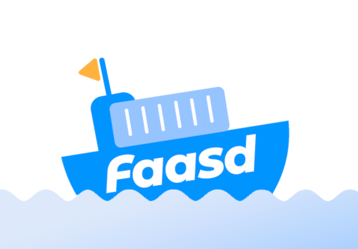

# faasd-cartridge 📦



## Motivation 🔋

[Porter](https://porter.sh/) implementation of ready-to-use faasd installations for different cloud provider.

## What is Porter? 🐱

Take everything you need to do a deployment, the application itself and the entire process to deploy it:
command-line tools, configuration files, secrets, and bash scripts to glue it all together. Package that into a
versioned bundle distributed over standard Docker registries or plain tgz files.

## What is faasd? 🛥️

faasd is OpenFaaS reimagined, but without the cost and complexity of Kubernetes. It runs on a single host with very
modest requirements, making it fast and easy to manage. Under the hood it uses containerd and Container Networking
Interface (CNI) along with the same core OpenFaaS components from the main project.

## How to use Porter ⚙️

Installing the porter CLI is quite straight forward. Just follow the [instructions](https://porter.sh/install/) for the
OS you are using.

The most important commands you need to get this cartridges up and runngin are:

- `porter build` - create the installer image for the cartridge

- `porter parameters generate xxx` - create the set of parameters

- `porter credential generate yyy` - create the set of credentials

- `porter install -c yyy -p xxx` - install the cartridge

## Current Cartridges 📦

### Attention ⚡

This PoC of porter with faasd is using Azure Blob Storage to safe the underlying `terraform` state.

So you need to provide following details via paramater and credentials of porter:

```bash
storage_account_name
container_name
access_key
```

### stackit-cartridge


Install faasd on STACKIT.

```bash
porter parameters generate faasd-stackit-params
porter credential generate faasd-stackit-cred
porter install -c faasd-stackit-cred -p faasd-stackit-params
```

### do-cartridge


Install faasd on DigitalOcean.

Dont forget to set the DIGITALOCEAN_TOKEN in the porter credentials call. 

```bash
export DIGITALOCEAN_TOKEN=xxx
porter parameters generate faasd-do-params 
porter credential generate faasd-do-cred
porter install -c faasd-do-cred -p faasd-do-params
```

### civo-openfaas-cartridge

Install OpenFaas on a Civo

```bash
 export CIVO_TOKEN=yyy
```